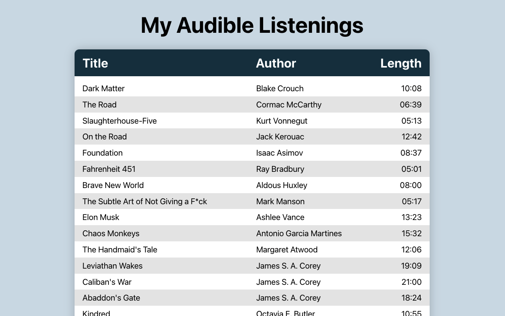
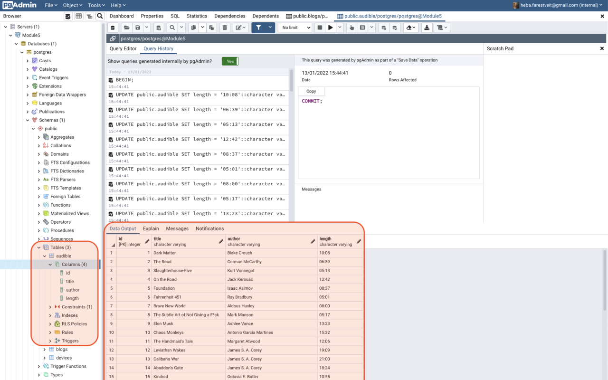
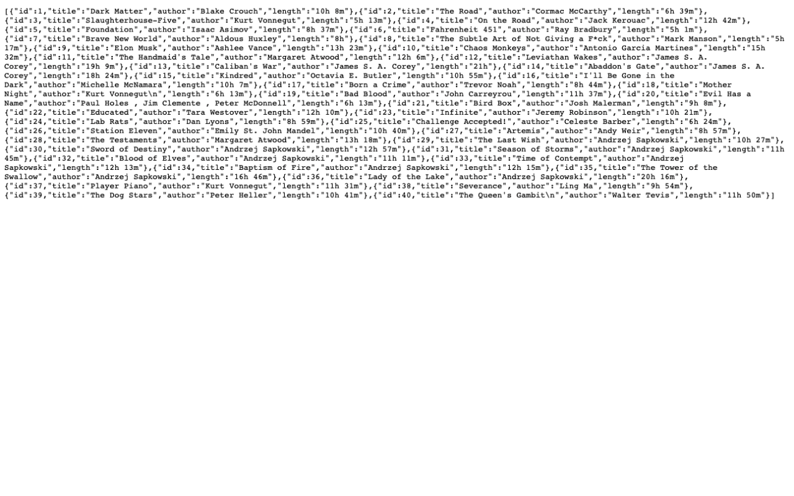

# SQL and Docker - PERN App

This project was bootstrapped with [Create React App](https://github.com/facebook/create-react-app).\
It is connected to this [database](https://github.com/hebaulf/pern-server).

 

I went through the [The PERN stack with Docker tutorial](https://ellertsmarik.medium.com/the-pern-stack-with-docker-for-beginners-9fa76e574d82) from Smári and then added another table called "audible", where I listed my Audible listenings, in the database and served that to the app.\
I also added some css styles to make it a little nicer to view.

 

**Remember** to run the database and the app at the same time on seperate terminal tabs.

 

### Screenshots of the app, server and server output:

  
  
  

 

## To open and view this project do the following
clone this repository to your computer:\
`git clone https://github.com/hebaulf/pern-app.git`

 

in the project directory, to add all dependencies, run:\
`yarn`  
  
or if you don't have yarn locally, run:\
`npm install`  

 

To open the project using localhost:3000 you can run:\
`npm run start`  
  
Open [http://localhost:3000](http://localhost:3000) to view it in your browser.  

 

There will be no content on the page as you have to run the database alongside the app.\
Go to [the server repository](https://github.com/hebaulf/pern-server) and follow the instructions in the README.md file there.
